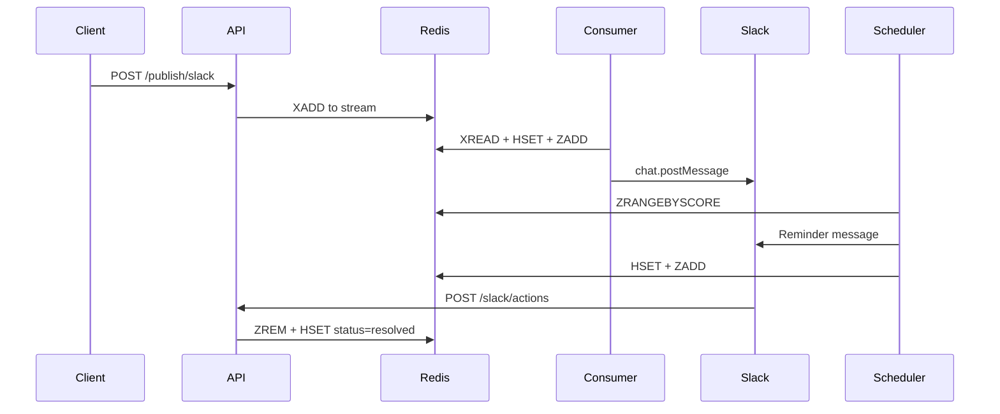

# 📡 Redis Stream Notification Service

A lightweight, environment-aware messaging system built with **FastAPI** and **Redis Streams**, designed to handle producer/consumer workflows and deliver real-time alerts via **Slack**.

---

## 🚀 Features

- ✅ Token-authenticated API for publishing messages
- ✅ Redis Streams used for `dev`, `uat`, and `prod` environments
- ✅ Stream status monitoring & cleanup endpoints
- ✅ Slack consumer integration for notifications
- ✅ Configurable via YAML and environment variables
- ✅ Built-in Makefile for local control (start/stop services)
- ✅ Pre-commit hooks for code quality enforcement (Black, isort, Flake8)

---

## 🔧 Setup

```bash
# Clone repo and install dependencies
poetry install

# Set up environment variable for token (via .env or .envrc)
export API_TOKEN=your-secret-token

# Run Redis and API
make start

# Or run individually
make redis-up
make api-up
```

---

## 🧪 API Endpoints

| Method | Endpoint              | Description                         |
|--------|------------------------|-------------------------------------|
| GET    | `/status/{env}`        | Check stream status for given env   |
| GET    | `/status`              | Check all environment stream status |
| POST   | `/publish/{env}`       | Publish a message to the stream     |
| DELETE | `/clear/{env}`         | Clear stream messages by environment |
| DELETE | `/clear`               | Clear all environment streams       |

> **Note:** All endpoints require a `token` header for authentication.

---

## 🔐 Security

This API is protected using a combination of:

1. **Static Token Authentication**
   Every request must include a valid token via the `token` HTTP header.

2. **HMAC-SHA256 Signature Verification**
   To prevent token leakage and replay attacks, every request must also include:
   - `x-timestamp`: A Unix timestamp (in seconds)
   - `x-signature`: A HMAC-SHA256 signature based on the timestamp and shared token

### How It Works

The client computes the signature like this:

```python
import time
import hmac
import hashlib
import requests

# === 設定區 ===
API_URL = "http://localhost:10000/publish/test"
API_TOKEN = "your-secret-token"  # 請換成你在 .env 裡設定的 token
MESSAGE = "Hello from Python client!"

# === 計算 timestamp 和 HMAC signature ===
timestamp = str(int(time.time()))  # 秒為單位的 timestamp
signature = hmac.new(
    API_TOKEN.encode(), timestamp.encode(), hashlib.sha256
).hexdigest()

# === Headers ===
headers = {
    "token": API_TOKEN,
    "x-timestamp": timestamp,
    "x-signature": signature,
}

# === 發送 POST 請求 ===
params = {"message": MESSAGE}
response = requests.post(API_URL, headers=headers, params=params)

# === 顯示結果 ===
print("Status code:", response.status_code)
print("Response:", response.json())

```

---

## 🧼 Code Quality

This project uses [pre-commit](https://pre-commit.com/) to enforce formatting and linting.

To run all pre-commit checks manually:

```bash
poetry run pre-commit run --all-files
```

---

## 🔁 Action Notification Lifecycle

This section explains, step by step, how an action-based Slack message flows through the system — from being published via API to resolution after a user clicks the button.

---

### 🧨 Step 1. Client calls `/publish/slack/{env}`

The client sends a payload like this:

```json
{
  "template": "action",
  "main_text": "📢 Reminder Test",
  "sub_text": "If you don't click within 10 seconds, you'll get reminded.",
  "recipient": "<@U08XXXXXXX>",
  "status": "info"
}
```

---

### 🧭 Step 2. FastAPI handles `/publish/slack/{env}`

The backend will:

1. ✅ Validate `token`, `x-timestamp`, and `x-signature`
2. ✅ Generate a `notification_id` (typically a millisecond timestamp)
3. ✅ Append the payload to Redis Stream:

```plain
XADD uat_stream * notification_id=... env=uat payload=...
```

---

### 🚚 Step 3. Consumer listens to Redis Stream

The `consumer` service reads from the stream using `XREADGROUP`, and does:

1. ✅ Sends the Slack message using `chat.postMessage` with interactive button
2. ✅ Receives the `thread_ts` from Slack response
3. ✅ Creates a Redis Hash:

```plain
HSET notification_meta:{notification_id} {
  recipient: "<@user>",
  thread_ts: "1742xxxxx.0000",
  template: "action",
  reminder_sent_count: 0,
  last_reminder_sent_time: 0,
  status: "pending"
}
```

4. ✅ Adds the notification to ZSET for reminder scheduling:

```plain
ZADD pending_notifications:{env} <remind_at_time> {notification_id}
```

---

### ⏰ Step 4. Scheduler triggers reminders every N seconds

The scheduler runs in a loop:

1. ✅ Calls `ZRANGEBYSCORE` to find overdue notifications:

```plain
ZRANGEBYSCORE pending_notifications:{env} 0 <current_time>
```

2. ✅ For each overdue `notification_id`:
   - Retrieves metadata from `notification_meta:{id}`
   - If `status == "pending"` and `time_diff >= timeout`, sends reminder

3. ✅ Sends Slack thread message:

```plain
chat.postMessage(thread_ts=..., text="⏰ Reminder #2 <@user> please take action!")
```

4. ✅ Updates metadata:

```plain
HSET notification_meta:{id} {
  reminder_sent_count += 1,
  last_reminder_sent_time = <now>
}
```

5. ✅ Reschedules the next reminder in the ZSET:

```plain
ZADD pending_notifications:{env} <now + timeout> {notification_id}
```

---

### 👆 Step 5. User clicks the Slack button

When the user clicks the button, Slack sends a POST to `/slack/actions`.

The API:

1. ✅ Parses the payload to get `notification_id`, `env`, and `thread_ts`
2. ✅ Calls `mark_as_resolved()`:
   - `ZREM pending_notifications:{env} {notification_id}`
   - Updates `status = "resolved"` in metadata
   - Records `resolved_time`

---

### 🧾 Final Result

- The system keeps reminding every N seconds until resolved
- Reminders are thread replies in Slack
- Once the user clicks the button, the reminders stop

---

### 🔎 Redis Example

```plain
ZSET:
  Key: pending_notifications:uat
  Value: 1742751234567 → 1742755000 (next remind_at time)

HASH:
  Key: notification_meta:1742751234567
  Fields:
    recipient: <@user>
    thread_ts: 1742754123.000000
    status: pending
    reminder_sent_count: 2
    last_reminder_sent_time: 1742754920
```

---

### 📈 Sequence Diagram (Mermaid format)

If your GitHub supports Mermaid, this diagram helps visualize the flow:


